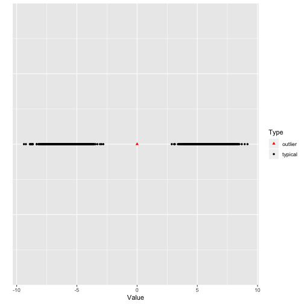
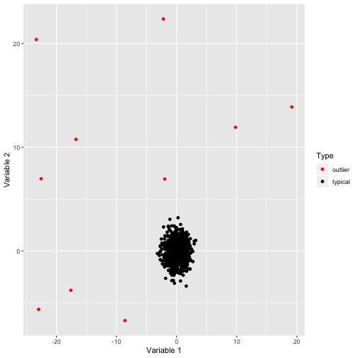

# stray {STReam AnomalY} 

<!-- rmarkdown v1 -->
[](https://www.repostatus.org/#wip)
[](https://www.gnu.org/licenses/old-licenses/gpl-2.0.html)

[](https://travis-ci.org/pridiltal/stray.svg?branch=master)

---
 
[](https://cran.r-project.org/)
[](https://cran.r-project.org/package=stray)
[](commits/master)
 
---
 
[](/commits/master)


<!-- README.md is generated from README.Rmd. Please edit that file -->


Anomaly Detection in High Dimensional Data Space

This package is a modification of [HDoutliers package](https://cran.r-project.org/web/packages/HDoutliers/index.html). HDoutliers is a powerful algorithm for the detection of anomalous observations in a dataset, which has (among other advantages) the ability to detect clusters of outliers in multi-dimensional data without requiring a model of the typical behavior of the system. However, it suffers from some limitations that affect its accuracy. In this package, we propose solutions to the limitations of HDoutliers,
and propose an extension of the algorithm to deal with data streams that exhibit non-stationary behavior. The results show that our proposed algorithm improves the accuracy, and enables the trade-off between false positives and 
negatives to be better balanced.


This package is still under development and this repository contains a development version of the R package *stray*.

## Installation

You can install oddstream from github with:


```r
# install.packages("devtools")
devtools::install_github("pridiltal/stray")
```
## Example

### One dimensional data set with one outlier

```r
library(stray)
require(ggplot2)
#> Loading required package: ggplot2
set.seed(1234)
data <- c(rnorm(1000, mean = -6), 0, rnorm(1000, mean = 6))
outliers <- find_HDoutliers(data)
display_HDoutliers(data,outliers )
```



### Two dimentional dataset with 8 outliers

```r
set.seed(1234)
n <- 1000 # number of observations
nout <- 10 # number of outliers
typical_data <- tibble::as.tibble(matrix(rnorm(2*n), ncol = 2, byrow = TRUE))
out <- tibble::as.tibble(matrix(5*runif(2*nout,min=-5,max=5), ncol = 2, byrow = TRUE))
data <- dplyr::bind_rows(out, typical_data )
outliers <- find_HDoutliers(data)
display_HDoutliers(data, outliers)
```



### High dimensionl data

```r
require(tourr)
outpoints <- matrix(rnorm(12, mean=200), nrow = 2)
colnames(outpoints) <- colnames(flea[,-7])
data <- rbind(flea[,-7], outpoints)
outliers <- find_HDoutliers(data)
display_HDoutliers(data, outliers)
```
